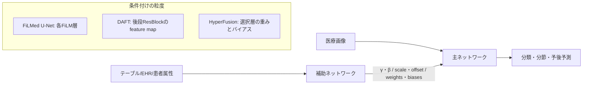

# Hypernetworkを用いた医療画像×テーブルデータのマルチモーダル深層学習研究

**エグゼクティブサマリ**  
本調査では、**医療画像と構造化テーブルデータを統合し、補助ネットワークが主ネットワークを条件付ける**という意味での Hypernetwork 系手法を、**査読済み**に限定して精査した。その結果、厳格な「重み生成」まで含めて高信頼に確認できた中核研究は、**FiLMed U-Net 系、DAFT 系、HyperFusion 系**の三系統にほぼ収束した。なかでも **HyperFusion** は最も直接的な hypernetwork であり、**DAFT** は医療画像×表形式融合における代表的な条件付け型ベースラインとして重要である。解析研究は少ないが、**DAFT のアブレーション**と **FiLMed U-Net の条件反実仮想実験**は、表形式情報が内部表現をどう変えるかを比較的明確に示している。総じて、この領域は有望だが、**症例数・外部検証・評価統一・臨床実装性**の面で未成熟である。 citeturn25view0turn9view0turn29view1turn30view2turn18view0

## 目次

- 調査範囲と検索戦略
- 発見した主要論文
- 手法比較と解析研究
- 総合考察と研究ギャップ
- 推奨文献

## 調査範囲と検索戦略

本調査では、**Hypernetwork / Hypernet / dynamic weight generation / feature-wise affine conditioning / FiLM-like conditioning** を含む語で、**医療画像 + 構造化テーブルデータ**（EHR、検査値、患者属性、臨床バイオマーカー等）を扱う査読済み研究を探索した。優先した情報源は、**公式出版社ページ、PubMed、MICCAI/MIDL 等の公式会議ページ、OpenReview/AAAI の公式会議プロシーディング**である。加えて、**内容把握のために arXiv HTML/README を補助的に参照した場合でも、採択判定は必ず査読済み版の存在で確認**した。背景文献としては、医療画像×EHR 融合の系統レビューが、2012–2020 の原著 17 本を抽出し、この分野が「小さいが成長中のサブセット」であると整理している。さらに 2023 年のレビューも、画像と非画像の深層融合を独立した研究潮流として位置づけている。 citeturn18view0turn39search6turn25view0turn9view0turn7view0turn11view0

除外基準は明確に設定した。**preprint のみ**で査読済み版が確認できない研究は除外し、**単純な late/early fusion や単なる特徴連結のみ**で、補助ネットワークによる主ネットワークの条件付けがない研究も原則除外した。また、**“hypernetwork” という語を使っていても、ニューラル重み生成ではなく位相的・グラフ理論的な hypernetwork** を指す研究は対象外とした。例えば、**MMY-Net** は患者メタデータ統合の重要研究だが、構造としてはメタデータ埋め込み＋多層融合であり、本調査の「hypernetwork/dynamic conditioning」主題からは外した。**Neural Hypernetwork Approach for Pulmonary Embolism diagnosis** も、医用画像×表データの重み生成系ではなく、別概念の hypernetwork であるため除外した。 citeturn37search0turn21search1turn21search3

検索の結果、**本調査で高信頼に直接該当すると判断できた主要系譜は少数**で、実質的には **FiLMed U-Net、DAFT、HyperFusion** が中核であった。ここで FiLMed U-Net と DAFT は、「補助ネットワークが γ/β や scale/offset を生成して主ネットワークの内部表現を条件付ける」ため、**狭義の full-weight hypernetwork ではないが、医療画像×テーブル融合における hypernetwork 的条件付け法**として含めた。最も厳密な意味での hypernetwork は、**HyperFusion** である。 citeturn30view2turn29view1turn25view0

## 発見した主要論文

以下の表に、本調査で採択した主要論文を整理する。**DAFT 2021 と DAFT 2022 は同一系譜だが、会議版とジャーナル版の双方を記録**した。

| 著者 | 年 | 会議/誌 | タスク | データセット | モダリティ | Hypernetworkの役割 | アーキテクチャ図の簡潔説明 | 主要結果 | 出典 |
|---|---:|---|---|---|---|---|---|---|---|
| Lemay et al. | 2021 | MIDL | セグメンテーション、少数ラベル学習、欠損ラベル下の多タスク分節 | 脊髄腫瘍 MRI データセット；多臓器分節ベンチマーク（脾臓・腎臓・肝臓、個別名は本文抽出では不明） | 画像 + 離散メタデータ（腫瘍型、臓器ラベル） | **FiLM generator** が各 FiLM 層の γ/β を生成する条件付け | 深さ 3 の U-Net に FiLM 層を各 conv unit 後に挿入し、共有 MLP が metadata から γ/β を生成 | 腫瘍型を入れると **平均 Dice +5.1%**、血管芽腫では **+10.5%**。少数ラベル設定では single-task U-Net 比で **最大 +16.7%**。入力腫瘍型を入れ替えると Dice が系統的に変化 | citeturn30view2turn30view1turn30view4 |
| Pölsterl, Wolf, Wachinger | 2021 | MICCAI | AD 三分類、MCI→認知症進行予測 | ADNI | 3D T1 MRI + 臨床表データ | 補助ネットが **scale/offset** を生成して feature map を動的 affine 変換 | 3D ResNet の最後の residual block に DAFT を挿入。画像特徴の GAP と tabular を統合して scale/offset を生成 | 診断で **balanced accuracy 0.622**、進行予測で **c-index 0.748**。Concat、FiLM、Duanmu 法より高性能 | citeturn7view0turn28view0turn29view0 |
| Wolf, Pölsterl, Wachinger et al. | 2022 | NeuroImage | AD 診断、time-to-dementia 予測 | ADNI；ジャーナル版では AIBL も謝辞に明示（ accessible abstract では具体的評価内訳不明 ） | 3D MRI + demographics/genetics/CSF/PET由来表データ | 補助ネットが **scaling factor と offset** を出力する汎用 conditioning module | 3D CNN の feature map を、画像 + tabular 由来の affine 係数で条件付ける「universal module」 | abstract で **balanced accuracy 0.622**、**c-index 0.748**。baseline 全体を上回ると報告 | citeturn9view0 |
| Duenias et al. | 2025 | Medical Image Analysis | 脳年齢推定、AD/CN/MCI 三分類 | 脳年齢: 健常 MRI **26,691 scans / 19 sources**；AD 分類: ADNI **2,120 例** | 3D MRI + 性別 / EHR 9属性（年齢・性別・教育、CSF、PET由来指標等） | **明示的 hypernetwork** が primary network の所定層の **weights/biases** を生成 | hypernetwork が tabular embedding から layer-specific parameters を生成し、primary image CNN の selected hyperlayers を更新 | AD 分類で **BA 0.673±0.012, macro AUC 0.822±0.006**。Concat (**0.638**) と DAFT-like (**0.658**) を上回る。脳年齢では male/female/mixed の全条件で image-only・concat より低 MAE | citeturn25view0turn33view4turn34view0turn35view4turn36view1 |

この一覧から見える最重要点は、**厳格な weight generation を採る HyperFusion は 2025 年時点でも稀少**であり、それ以前の主要研究は **FiLM/DAFT 型の feature-wise affine conditioning** が中心だったことである。つまり、この分野ではまず「中間表現の条件付け」が発展し、その後に「重み生成型 hypernetwork」が登場した、という技術史として理解するのが妥当である。 citeturn30view2turn29view1turn25view0

## 手法比較と解析研究

下図は、採択研究に共通する処理を抽象化した概念図である。**左のテーブル/EHR が補助ネットワークに入り、右の画像主ネットワークに対して γ/β、scale/offset、あるいは weights/biases を与える**点が、単純連結型マルチモーダル学習との本質的な違いである。FiLMed U-Net は各層の affine conditioning、DAFT は後段 residual block の affine conditioning、HyperFusion は selected layers の重み生成に位置づく。 citeturn30view2turn28view0turn25view0

### 手法比較表

| 手法 | 構成要素 | 学習手法 | 融合方式 | 計算コスト/パラメータ | 再現性 | 根拠 |
|---|---|---|---|---|---|---|
| FiLMed U-Net | U-Net depth 3 + FiLM layer。metadata を入れる **MLP generator** は 2 hidden layers **64, 16**。各 filter に対して γ/β を生成 | 損失関数の本文抽出は不明。FiLM パラメータは sigmoid で 0–1 に制約され、各 conv unit 後に配置 | **feature-wise affine modulation** を encoder–decoder 全体へ挿入 | 「計算コストは低く、画像解像度に依存しない」と明記 | **ivadomed** で公開 | citeturn30view3turn11view0turn30view5 |
| DAFT | 3D ResNet、左海馬 ROI、補助ネットは **GAP(image features)+tabular** を入力し scale/offset を出力 | 診断は **cross-entropy**、進行予測は **negative partial log-likelihood of Cox model**。最適化は **AdamW**。30/80 epochs、lr・weight decay を grid search | **late-intermediate affine conditioning**。最後の ResBlock 内 feature map を条件付け | 1 epoch の学習時間は **ResNet 8.9s / FiLM 8.7s / DAFT 9.0s** と差が小さい | GitHub 公開 | citeturn29view0 |
| HyperFusion | primary image CNN + layer-specific hypernetwork。AD 分類では last ResBlock の downsample conv、脳年齢では **4 linear layers** を hyperlayers に選択 | 脳年齢は regression loss + regularization、AD 分類は **regularized WCE loss**。最適化は **Adam**。tabular embedding MLP を事前学習。V100 32GB 使用 | **explicit weight generation**。tabular から selected layers の **weights/biases** を生成 | accessible text では総パラメータ数不明。ただし hyperlayer 選択を entropy と validation ablation で決定 | GitHub 公開 | citeturn34view0turn33view4turn35view3turn26view0 |

### 解析研究の要点

この領域では、**性能報告だけでなく「条件付けが内部表現をどう変えるか」を直接調べた研究が少ない**。そのなかで、FiLMed U-Net と DAFT は比較的強い解析を持つ。Lemay らは、**入力する腫瘍型ラベルを反実仮想的に入れ替える**実験を行い、**真の腫瘍型を与えたときに Dice が最も高くなる**こと、特に血管芽腫では誤った metadata を入れると Dice が大きく落ちることを示した。これは、表形式情報が単なる後段の補助特徴ではなく、**分節マスクの形状そのものを条件付けている**ことを示す重要な解析である。 citeturn30view4

DAFT の解析はさらに体系的である。著者らは、**挿入位置、scale の活性化関数、scale と offset のどちらが本質的か**を検証し、DAFT が挿入位置に比較的頑健であること、診断課題では **scaling が shifting より重要だが、どちらかを外すと少なくとも 0.013 bACC の低下**が起こること、進行予測では scale/offset の最適設定が課題依存であることを示した。さらに test-time ablation で、**DAFT は FiLM より γ/β の変動幅が大きく、より “dynamic” に振る舞う**こと、特に **offset 側の条件付け除去で性能低下が大きい**こと、そして **FiLM より noisy γ/β に頑健**であることを報告している。 citeturn29view1turn29view2

HyperFusion の解析は、**どの層を hypernetwork で置き換えるべきか**に集中している。脳年齢推定では、**loss entropy と validation ablation に基づいて 4 つの線形層**を hyperlayers に選び、AD 分類では、線形層よりも **最後の Res-block 内 downsample convolution** を hyperlayer にする構成が最良だった。これは、**“どこを生成するか” が性能に強く効く**ことを示しており、医療マルチモーダル hypernetwork の設計空間がまだ十分に探索されていないことを意味する。加えて、脳年齢推定では **male / female / mixed のすべての train-test 条件で HyperFusion が image-only と concatenation を上回る**と報告され、性別という単純な tabular prior であっても、動的条件付けが画像解釈を変えうることが示された。 citeturn35view3turn35view4turn36view1

以上を総合すると、解析研究の現状は、**可視化や反実仮想条件付けまでは進んでいるが、特徴空間の幾何学的解析、OOD ロバストネス、施設間シフト下の表現安定性、臨床的説明可能性評価**はまだ手薄である。特に、HyperFusion は強力だが、**DAFT のような詳細アブレーション密度にはまだ達していない**。 citeturn29view1turn34view0turn35view4

## 総合考察と研究ギャップ

最も大きいギャップは、**研究数そのものの少なさ**である。医療画像×EHR/表データ融合は全体として増えているが、systematic review の時点でも 2012–2020 に抽出された原著は 17 本にとどまり、そこからさらに **“主ネットワークを補助ネットワークが条件付ける”** 研究に絞ると、査読済みの直接例はかなり限られる。実際、HyperFusion は 2025 年論文中で、**医療領域における異種モダリティ融合に hypernetwork を用いる初の試み**と位置づけている。表データ統合研究の主流は、なお連結・注意機構・late fusion に偏っている。 citeturn18view0turn32view0

第二に、**評価の不統一**が強い。DAFT は balanced accuracy と c-index を用い、HyperFusion は BA、precision、macro F1、macro AUC、class-wise TP を併用し、FiLMed U-Net は Dice を主指標とする。これはタスク差ゆえ当然だが、**multimodal conditioning の寄与を横断比較できる共通評価軸**が不足している。さらに、DAFT と HyperFusion では **使用する ADNI subsets、属性集合、クラス比、補助損失、学習手順が異なる**ため、単純な数値比較は難しい。HyperFusion 自身も、reported DAFT results と自前の DAFT-like 実装を分けて提示している。 citeturn29view0turn34view0

第三に、**臨床実装への障壁**が大きい。条件付け型モデルは臨床的には魅力的だが、実運用では **欠測、施設差、測定規格差、表データ分布の時間変化**が避けられない。DAFT は欠測指示変数を追加して不完全 tabular を扱い、HyperFusion も属性選択と正則化付き損失で安定化を試みるが、**前向き外部検証、長期運用、施設横断再現性**はまだ十分ではない。特に table modality の品質が落ちると、条件付けが誤誘導になる危険がある。 citeturn28view0turn34view0

第四に、今後の研究課題としては、**双方向条件付け**が有望である。HyperFusion 論文自体が、将来課題として **“画像で EHR 処理を条件付ける逆方向”** を挙げている。また、Transformer や foundation model に hypernetwork を組み合わせる設計、selected hyperlayers の自動探索、modality missingness への耐性、校正・不確実性評価、施設間 OOD 解析は、今後の中核テーマになるはずである。加えて、分節タスクでは FiLMed U-Net のような **metadata swap 実験**、分類タスクでは **counterfactual EHR perturbation** を標準評価に組み込むべきである。 citeturn32view0turn30view4turn29view1

### 未解決点と限界

本レポートにはいくつか限界がある。第一に、**脳年齢推定の MAE の厳密数値**は、access 可能だった HyperFusion の本文では図示中心で、本文行抽出からは完全な数表を回収できなかったため、**定性的優位**として報告した。第二に、DAFT 2022 のジャーナル版は PubMed abstract から主要内容を確認できたが、**AIBL を用いた詳細内訳**までは accessible lines から十分に再構成できなかった。第三に、2024–2026 の画像×metadata 融合論文には MMY-Net など関連研究があるが、**厳密には hypernetwork/dynamic weight generation ではない**ため、本体比較からは外した。これらは今後、より広い「条件付きマルチモーダル学習」レビューでは重要な比較対象になる。 citeturn35view4turn36view1turn9view0turn37search0

## 推奨文献

**最優先で読むべき文献**は三つある。第一に、**HyperFusion** は、医療画像×表データ融合において **最も直接的な explicit hypernetwork** を提示し、AD 分類で DAFT-like を上回る性能を示したため、この調査主題に最も合致する。第二に、**DAFT: A universal module to interweave tabular data and 3D images in CNNs** は、条件付け型融合の設計・実証・アブレーションが最も充実しており、実務上の設計指針が得やすい。第三に、**Benefits of Linear Conditioning with Metadata for Image Segmentation** は、分節タスクで metadata conditioning が本当に mask を変えていることを、定量・反実仮想の両面から示していて、解析研究として価値が高い。 citeturn25view0turn9view0turn30view2turn30view4

**次点の重要文献**としては、**DAFT の MICCAI 2021 会議版**を挙げたい。ジャーナル版より短いが、医療画像×表データ条件付けの問題設定、ベースライン比較、学習時間の軽さ、アブレーションの方向性が簡潔にまとまっており、この領域の入口として読みやすい。 citeturn7view0turn29view0turn29view1

**基盤理解のための補助文献**としては、まず **HyperNetworks**（ICLR 2017）と **FiLM: Visual Reasoning with a General Conditioning Layer**（AAAI 2018）を推奨する。前者は「ネットワークが別のネットワークの重みを生成する」という発想の原典であり、後者は γ/β による feature-wise affine conditioning を一般化した。医療応用研究の実装上は、DAFT や FiLMed U-Net がこの二つの系譜を医用マルチモーダルへ移植したものと理解できる。さらに、背景整理には **Fusion of medical imaging and electronic health records using deep learning** と **Deep multimodal fusion of image and non-image data in disease diagnosis and prognosis: a review** が有用である。 citeturn41search0turn42search0turn18view0turn39search6

**優先度付きの推薦順**をまとめると、  
**A**: Duenias et al., *Hyperfusion*, MedIA 2025。 citeturn25view0  
**A**: Wolf et al., *DAFT*, NeuroImage 2022。 citeturn9view0  
**B**: Pölsterl et al., *Combining 3D Image and Tabular Data via the Dynamic Affine Feature Map Transform*, MICCAI 2021。 citeturn7view0  
**B**: Lemay et al., *Benefits of Linear Conditioning with Metadata for Image Segmentation*, MIDL 2021。 citeturn11view0  
**C**: Ha et al., *HyperNetworks*, ICLR 2017。 citeturn41search0  
**C**: Perez et al., *FiLM*, AAAI 2018。 citeturn42search0  
**C**: Huang et al., *Fusion of medical imaging and electronic health records using deep learning*, npj Digital Medicine 2020。 citeturn18view0  
**C**: Cui et al., *Deep multimodal fusion of image and non-image data in disease diagnosis and prognosis: a review*, Progress in Biomedical Engineering 2023。 citeturn39search6