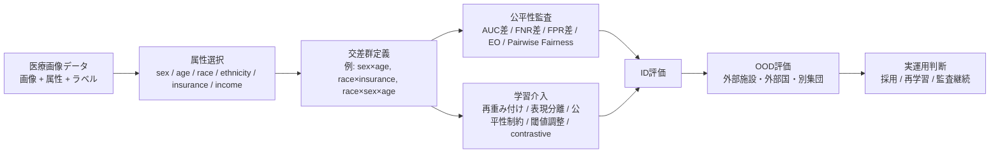
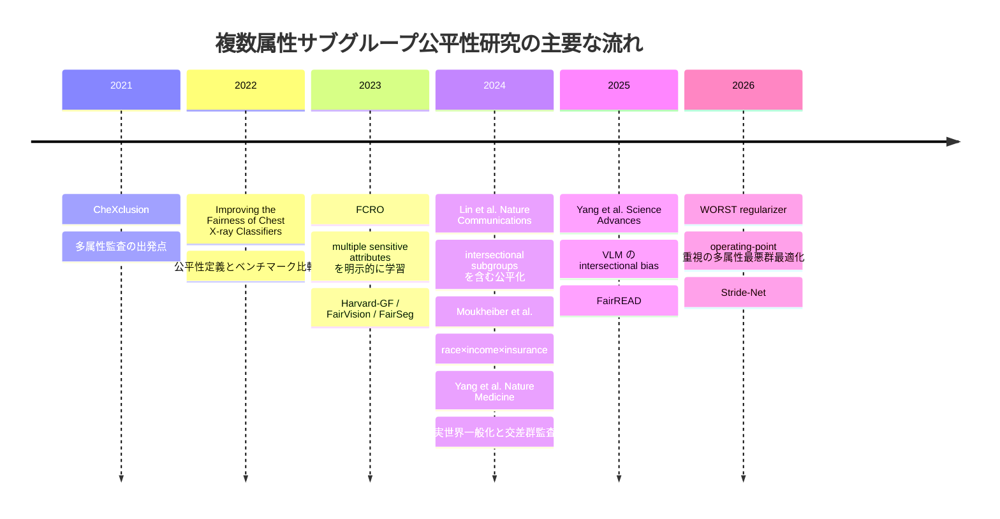
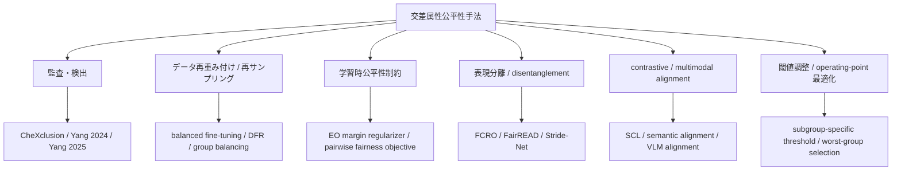

# 医療画像における深層学習の公平性研究と複数属性サブグループ公平性のサーベイ

## Executive Summary

医療画像における深層学習の公平性研究は、二〇二一年前後から胸部X線を中心に急速に発展してきましたが、**複数属性の組合せに基づくサブグループ公平性**を真正面から扱った研究は、二〇二六年時点でもまだ少数です。高信頼な先行研究を広く見渡すと、明示的に複数属性を扱う主流は、胸部X線分類を対象とした **FCRO**、**Lin らの marginal pairwise equal opportunity**、**Moukheiber らの race×income×insurance**、**FairREAD**、**Yang らの実世界一般化監査**、**Yang らのVLM監査**、そして最新の **Worst-Group Equalized Odds Regularization** や **Stride-Net** に集中しています。対照的に、CT、MRI、病理画像、一般病理WSI、眼底・OCT以外の領域で、明示的な intersectional fairness を実証した研究はまだ薄い、というのが最も重要な結論です。 citeturn22view0turn5view0turn7view0turn10view0turn9search5turn15view0turn18view0turn20search0

この分野で繰り返し確認されている知見は三つあります。第一に、**単一属性で「公平」に見えても、交差属性では不公平が増幅されうる**ことです。Lin らは intersectional groups で pairwise fairness 差が単独属性より大きいことを報告し、Yang らは OOD 条件で sex×race などの交差集団に大きな underdiagnosis gap が出ることを示しました。第二に、**AUC だけでは臨床的な不公平を見逃しやすい**ことです。FNR/FPR や Equalized Odds のような operating-point ベースの指標、あるいは pairwise fairness のようなランキング指標が臨床上の意味を持ちやすいと複数研究が示しています。第三に、**公平性改善はデータ分布シフトに弱い**ことです。訓練分布内で見かけ上の公平性を達成しても、外部施設や別集団では再び崩れるため、実運用前評価では外部データと交差属性単位の再監査が必須です。 citeturn5view0turn10view0turn18view0

研究トレンドとしては、初期の研究が **バイアス監査** と **単一属性ギャップの可視化** に重点を置いていたのに対し、近年は **多属性表現学習**、**サブグループ別閾値調整**、**最悪群ベース正則化**、**コントラスト学習**、**基盤モデル・VLM の intersectional audit** に移っています。ただし、現時点の成果の多くは胸部X線で検証されており、**非CXRモダリティへの一般化、希少交差群の統計的不確実性、実装の再現性、規制・運用の接続**が未解決です。 citeturn32view0turn22view0turn5view0turn10view0turn11view1turn15view0turn18view0turn20search0

下図は、このサーベイで扱う中心テーマの概念図です。主な構成は、公開データの属性情報、交差群定義、指標選択、手法、運用評価という五層で整理できます。図の内容は本文で詳述する主要研究群に対応します。 citeturn22view0turn5view0turn7view0turn10view0turn15view0turn18view0

## 検索戦略と優先ソース

本レポートでは、期間を主に二〇一五–二〇二六年に設定し、**原著論文を最優先**として収集しました。優先ソースは、PubMed、IEEE Xplore、ACM Digital Library、arXiv、PMLR/OpenReview、Nature Medicine、Nature Communications、Science Advances、RSNA Radiology: Artificial Intelligence、MICCAI/IPMI/ICLR/CHIL/NeurIPS/ICML 系の会議・誌面です。レビュー論文は俯瞰の補助としてのみ用い、個別の知見はできる限り原著から確認しました。公平性研究の全体像把握には npj Digital Medicine の系統的レビューと、交差公平性の一般機械学習サーベイも参照しました。 citeturn25search0turn33search5turn25search5

検索語は、`medical imaging fairness intersectional`, `multi-sensitive attributes medical image`, `chest x-ray fairness age sex race`, `intersectional subgroup fairness medical imaging`, `race insurance income chest x-ray fairness`, `vision-language foundation model fairness medical imaging` などを組み合わせ、**モダリティ名** と **属性組合せ** を併記しました。とくに「sex×age」「race×insurance」「race×income×insurance」「race×sex×age」のように、交差群の定義がタイトル・要旨・方法に明記されている論文を優先抽出しました。結果として、高信頼の実証研究の多くが胸部X線に集中し、眼科領域で複数属性を扱う研究はデータセット/ベンチマーク主導、CT・MRI・病理画像はまだ相対的に少ないことが確認されました。 citeturn22view0turn7view0turn10view0turn37search0turn28search0

主要マイルストーンは以下の通りです。二〇二一–二〇二二年は胸部X線の公平性監査とベースライン比較、二〇二三年は multiple sensitive attributes を直接扱う方法論と眼科公平性データセット、二〇二四–二〇二五年は実世界一般化・VLM・CheXpert Plus・大規模眼科 fairness dataset、二〇二六年は operating-point ベースの最悪群正則化やパッチレベル表現学習へと展開しています。 citeturn30academia19turn32view0turn22view0turn28search0turn10view0turn11view1turn18view0turn20search0

## 複数属性サブグループを明示的に扱う先行研究

以下の表は、**複数属性サブグループを明示的に扱った論文**を中心に整理したものです。ここでは、評価のみが intersectional なのか、学習手法自体が複数属性を扱うのかを区別して記載しました。なお、二〇二五–二〇二六年の一部は preprint を含みます。

| 論文情報 | モダリティ / タスク | 扱う属性の組合せ | サブグループ定義 | 評価指標 | 手法の要約 | 主要結果 | コード / データ |
|---|---|---|---|---|---|---|---|
| **Deng et al., 2023, IPMI** “On Fairness of Medical Image Classification with Multiple Sensitive Attributes via Learning Orthogonal Representations” | 胸部X線 / 胸部所見分類 | race × sex × age | 複数 sensitive attributes の直積で conjunction を構成し、CheXpert 上で multi-sensitive learning | fairness–utility trade-off、AUC 系 | **FCRO**。標的表現と sensitive 表現の列空間・行空間直交化により multi-sensitive fairness を学習 | 医療画像で複数 sensitive attributes を直接扱う初期の代表例。CheXpert 上で fairness–utility trade-off を改善 | コードあり、CheXpert 利用 citeturn22view0turn23search5turn21search2 |
| **Lin et al., 2023, Nature Communications** “Improving model fairness in image-based computer-aided diagnosis” | CXR、眼底写真 / COVID-19、胸部異常、POAG、Late AMD | age × race、age × sex、加えて single attributes と genotype | MIDRC では age–race、OHTS では age–sex の intersectional groups を評価 | AUC、Pairwise Fairness Difference (PFD) | marginal pairwise equal opportunity を最適化し、最も不利な群を重点更新 | PFD は多くの設定で **35%以上**減少し、AUC の相対変化は概ね **1%以内**。intersectional groups で bias 増幅も報告 | データは公開データ、コード公開は本文からは未確認 citeturn5view0 |
| **Moukheiber et al., 2024, arXiv preprint** “Looking Beyond What You See…” | 胸部X線 / multi-label disease diagnosis | race × insurance × income | MIMIC-CXR を MIMIC-IV / MIMIC-SDOH と連結し、**8交差群**を構成 | EO difference、AUCavg、WACCavg、AFavg | 事前学習後に最終層を balanced group sampling で再学習し、公平性制約を導入 | EO_Diffavg を **0.4243→0.3224** に改善。multi-label・SDOH を含む intersectional fairness の数少ない実証 | 重み公開予定の記述あり。MIMIC 系は申請制 citeturn7view0 |
| **Yang et al., 2024, Nature Medicine** “The limits of fair medical imaging AI in real-world generalization” | 主に胸部X線、補助的に皮膚・眼科画像 | sex × race を中心に、race・sex・age | CXR では White male / Black female などの交差群を明示評価 | FPR/FNR gap、EO 観点、OOD fairness | 主眼は**監査**。shortcut removal 法も比較し、ID と OOD を体系評価 | 訓練分布内で「局所的に公平」でも、外部データでは崩壊しうる。**demographic shortcut が弱いモデルが OOD ではより globally optimal** な場合がある | コードあり、公開データ中心 citeturn10view0turn30search14 |
| **Yang et al., 2025, Science Advances** “Demographic Bias of Expert-Level Vision-Language Foundation Models in Medical Imaging” | 胸部X線 / VLM zero-shot diagnosis | race × sex を含む intersectional groups | 例として **Black female** を明示 | AUC、TPR/TNR、underdiagnosis disparity | CheXzero 系 VLM を複数データセットで監査 | 放射線科医と比べても、VLM は marginalized groups を系統的に underdiagnose。intersectional groups でギャップがさらに大きい | コードあり、複数公開CXRデータ使用 citeturn9search5turn11view1 |
| **Gao et al., 2025, Medical Image Analysis** “FairREAD” | 胸部X線 / 4疾患分類 | age × gender × race | 3属性を二値化し **8群**。CheXpert を不均衡化して評価 | Accuracy、AUC、EO disparity、AUC disparity、AF/WACC | demographic-invariant 表現を disentangle した後、**demographic information を controlled re-fusion**。さらに subgroup-specific threshold | 4疾患で一貫して fairness–accuracy trade-off を改善。閾値学習も効果 | PubMedでコード公開明記、CheXpert 利用 citeturn15view0turn14search4 |
| **Luo et al., 2023, arXiv preprint** “FairVision” | 眼底SLO + 3D OCT / AMD, DR, glaucoma | 主に race × gender × ethnicity、属性は計6種 | multi-attribute fairness を 2D/3D 眼科画像で比較 | performance-scaled disparity measures | **FIS** による fair identity scaling。眼科3疾患の multi-attribute fairness を包括評価 | 3D 医療画像での fairness を体系的に検査した初期研究。複数 protected attributes で FIS が競合を上回ると報告 | コードと Harvard-FairVision 公開 citeturn37search0turn37search1turn37academia12 |
| **Kurian et al., 2026, arXiv preprint** “Worst-Group Equalized Odds Regularization for Multi-Attribute Fair Medical Image Classification” | RNFL-OCT、MIMIC-CXR | age × race × sex を同時考慮 | 交差群を直接列挙せず、各 mini-batch で属性横断的に最悪群を選択 | EOdds、EOM、AUC | operating-point の under/over-diagnosis を狙う **worst-group EO margin regularizer** | RNFL-OCT で joint EOdds **0.354→0.226**、MIMIC-CXR で **0.254→0.127** と改善、AUC低下は小さい | コード本文では未確認、データは公開/申請制 citeturn18view0turn19view0 |
| **Rashid et al., 2026, arXiv preprint** “Stride-Net” | 胸部X線 | race × gender | race と intersectional race–gender subgroups | fairness–accuracy trade-off、EOM 系 | patch-level masking + adversarial confusion + disease label embedding alignment | MIMIC-CXR / CheXpert で race と race–gender 群の公平性を改善しつつ精度維持と主張 | コードあり citeturn20search0 |

この表に加えて、**CheXclusion** は明示的な交差属性最適化ではないものの、年齢・性別・人種・保険種別にわたる多属性監査の起点として極めて重要です。また **Zhang らの CHIL 2022** は multiple sensitive attributes 全体のベンチマーク比較を行い、単純なバランシングが強力なベースラインであること、グループ公平性を満たす方法がしばしば全群の性能低下で達成されることを示しました。これらは intersectional fairness 手法を理解する上での前提知識として必須です。 citeturn30academia19turn32view0

## 手法分類と比較

交差属性公平性の方法論は、大きく **監査・検出**、**再重み付け / 再サンプリング**、**公平性制約**、**表現分離 / disentanglement**、**コントラスト・マルチモーダル整合**、**閾値調整 / operating-point 最適化** に整理できます。医療画像では、とくに「患者転帰に直結する誤り」を重視するため、一般機械学習の demographic parity 一辺倒よりも、**EO / EOpp / FNR gap / FPR gap** の臨床的解釈が前面に出る傾向があります。 citeturn10view0turn5view0turn18view0turn33search5

### 監査・検出系

監査系の長所は、**現状の危険性を可視化できる**こと、そして新規手法を導入しなくても施設・集団間の差を把握できることです。Yang らの Nature Medicine 論文や Science Advances 論文はこの系譜の代表で、訓練分布内と外部分布、そして単一属性と交差属性の両方を比較した点で非常に実務的です。欠点は、当然ながら**不公平を検出しても、それを直接改善しない**ことです。また、監査指標はしばしば小群サンプルに不安定で、交差群が増えるほど不確実性管理が難しくなります。 citeturn10view0turn11view1turn33search0turn33search1

### 再重み付け・再サンプリング系

再重み付けや balanced mini-batch は実装が容易で、CHIL 2022 でも「強いベースライン」として確認されました。Moukheiber らの balanced group sampling と最終層 fine-tuning は、**低コストに intersectional fairness を改善しやすい**点が魅力です。欠点は、群が細分化されるほどサンプル不足が深刻化し、**希少交差群では過学習や高分散**を招きやすいことです。OOD では効果が不安定になりうる点も注意が必要です。 citeturn32view0turn7view0turn10view0

### 公平性制約系

Lin らの marginal pairwise equal opportunity や Kurian らの worst-group EO regularizer は、**何を公平にしたいかを損失関数に直接埋め込む**アプローチです。臨床的な underdiagnosis / overdiagnosis を直接減らしたいときに理にかなっています。長所は目標が明確なこと、短所は**指標依存性が強い**ことです。固定しきい値での公平性を改善しても、別の臨床 operating point では効果が変わることがあります。また、複数属性で同時に制約を課すと、最適化が不安定になりやすいです。 citeturn5view0turn18view0

### 表現分離・disentanglement 系

FCRO、FairREAD、Stride-Net はこの代表例です。表現から demographic signal を抑制しつつ、診断に必要な情報を保持する狙いがあります。長所は、**推論時の頑健性や汎化**を期待できること、また多属性を一つの表現空間で扱えることです。欠点は、**「消してはいけない臨床的に関連した属性情報」まで落としてしまう危険**です。FairREAD が demographic information の再注入を行うのは、この問題への反省的な設計と解釈できます。 citeturn22view0turn15view0turn20search0turn25search15

### contrastive・マルチモーダル整合系

supervised contrastive learning による fair embeddings や、Stride-Net の label-embedding alignment、VLM fairness 研究はこのカテゴリに入ります。長所は、**shortcut を減らしつつ表現の意味的構造を維持しやすい**ことです。欠点は、設計が複雑で、どの対照ペアやプロンプトが公平性に寄与したのかを解釈しにくいことです。また、Lin らや Yang らの結果が示すように、見かけの公平性改善が OOD で維持される保証はありません。 citeturn26view0turn20search0turn11view1turn10view0

### 実務上の適用条件

総じて、**データ量が限られ、交差群が希少なら監査 + しきい値最適化 + 外部評価**が現実的です。十分なデータと属性ラベルがある場合は、**FCRO / FairREAD / worst-group regularization** のような学習時介入を検討する価値があります。反対に、施設間分布シフトが大きい運用では、Yang らが示したように、訓練分布内 fairness のみを最適化したモデルよりも、**demographic shortcut の少ないモデル選択**の方が OOD では安全な場合があります。 citeturn22view0turn15view0turn10view0turn18view0

## 実データセットとベンチマーク事例

以下の表は、複数属性サブグループ公平性を検討する際に重要な実データセットをまとめたものです。**サブグループ数は、文献で実際に使われた設定、または代表的な二値化 / 三値化に基づく典型値**であり、厳密には研究ごとの離散化方針に依存します。

| データセット | モダリティ | 含まれる属性 | 典型的なサブグループ数 | アクセス性 |
|---|---|---|---|---|
| **MIMIC-CXR / MIMIC-CXR-JPG**（必要に応じて MIMIC-IV, MIMIC-SDOH 連結） | 胸部X線 | 画像・ラベルに加え、連結により age, sex, race/ethnicity、保険、SDOH 属性を利用可能 | 例: age(4)×sex(2)×race(3)=24、または income×insurance×race=8 | PhysioNet 認証・DUA 必須 citeturn35search0turn35search1turn7view0 |
| **CheXpert / CheXpert demographic labels / CheXpert Plus** | 胸部X線 | age, sex, race, ethnicity、CheXpert Plus では insurance type, BMI, deceased, interpreter なども追加 | 例: age(2)×sex(2)×race(2)=8、あるいはさらに ethnicity / insurance を加えて拡張可能 | 研究利用可、demographic labels / Plus は Stanford AIMI 経由 citeturn34search7turn34search14turn34search2 |
| **MIDRC** | 胸部X線中心 | age, sex, race、ethnicity を含む公開ノートブックあり | 例: age bins × sex(2) × race(多値) で可変。Lin らでは intersectional group も評価 | 公開データコモンズ、対象コレクションにより条件付き citeturn5view0turn39search1turn39academia12 |
| **NIH ChestXray14** | 胸部X線 | age, sex、文献によって race の利用可否が異なるが、少なくとも age/sex 監査は広く実施 | 例: age(2)×sex(2)=4 | 公開利用可 citeturn26view0turn38search7 |
| **PadChest** | 胸部X線 | patient demography と acquisition info。少なくとも age/sex は広く利用 | 例: age(2)×sex(2)=4 | 無償研究利用、正式申請あり citeturn36search0turn36search9 |
| **Harvard-GF** | 2D/3D 眼科 OCT 系 | race、gender、ethnicity | 例: race(3)×gender(2)=6 | 公開データ・コードあり citeturn28search0turn28search7turn37search2 |
| **Harvard-FairSeg** | SLO fundus segmentation | gender, race, ethnicity, preferred language, marital status | 二値/多値化次第で大きく増える。5属性を併用すると交差群は急増 | 公開データ・コードあり citeturn29academia21turn12search8turn12search10 |
| **Harvard-FairVision30k** | SLO fundus + 3D OCT | age, gender, race, ethnicity, preferred language, marital status | 例: age(2)×gender(2)×race(3)=12。6属性全体ではさらに増大 | 非商用研究向け公開、ライセンスあり citeturn37search0turn37search1turn37search8 |

この表から分かる通り、**CXR は既存臨床データに demographic metadata を後付け連結しやすく、intersectional fairness 研究の主戦場**になっています。一方、眼科では Harvard-GF、FairSeg、FairVision のように、最初から fairness learning を意識したデータセットが登場しており、**「属性が少ないから交差群を評価できない」という制約を緩和しつつある**点が重要です。反面、交差群が増えると各群の症例数が急速に減るため、データセット規模そのものが公平性研究のボトルネックになります。 citeturn7view0turn37search0turn29academia21turn30search11

## 評価指標の実務的解釈と推奨

複数属性サブグループの公平性評価では、**AUC 差だけに依存しない**ことが最重要です。Yang らと Kurian らは、ともに AUC が似ていても固定しきい値では FNR/FPR の群差が大きくなりうることを示しており、Lin らも従来の accuracy / sensitivity / specificity より pairwise fairness の方が臨床判断支援の文脈で適切だと論じています。したがって、実務では **全体AUC + subgroup AUC + FNR/FPR gap + EO/EOpp + calibration + 不確実性** をセットで報告すべきです。 citeturn10view0turn18view0turn5view0

臨床スクリーニングや見逃し回避が主眼なら、**疾患陽性例における FNR gap** が最も解釈しやすい指標です。Nature Medicine 論文では「No Finding」は FPR、それ以外の疾患は FNR を underdiagnosis の代理として評価しており、これは患者不利益に沿った選択です。**Equalized Odds** は FPR と TPR の両方をみるので、過少診断・過剰診断の両面を監査したい場合に有用です。**Pairwise fairness** は、確率スコアを triage や優先順位付けに使う場合に適しています。**Differential fairness** や worst-case disparity は、交差群が多く sparsity が強い場合に理論的に有用な補助指標です。 citeturn10view0turn5view0turn33search1turn27search10

統計的検定については、医療画像公平性論文の実務慣行として、**患者単位 bootstrap による信頼区間**、**群差の仮説検定**、**多重比較補正** が推奨されます。Lin らは paired t test や平均差を用い、Yang らは Bonferroni 補正付きの仮説検定で distribution shift を定量化し、Science Advances 論文も bootstrap により subgroup 指標の不確実性を推定しています。交差群が増えるほど有効サンプルが減るので、**群あたりの陽性/陰性イベント数**を事前に確認し、不足する場合は群統合・階層モデル・ベイズ平滑化を検討すべきです。公平性監査のためのサンプルサイズ設計については、Singh らのチュートリアルが直接的な指針を与えています。 citeturn26view0turn10view0turn30search16turn30search11

実務向けの推奨をまとめると、次の順序が堅実です。  
第一に、**事前登録した少数の主要交差群**を定義することです。全属性の総当たりは群が疎になりすぎます。第二に、**臨床閾値固定の EO / FNR / FPR と、閾値非依存の AUC / pairwise fairness を併用**することです。第三に、**patient-level bootstrap CI を必ず併記**することです。第四に、**OOD 外部データで再評価**することです。第五に、性能が高くても交差群で不公平なら、モデル採用を保留し、閾値調整・再重み付け・representation debiasing を順に試験することです。これが現在の文献から導ける実務的なベストプラクティスです。 citeturn10view0turn5view0turn18view0turn30search11

## 研究ギャップと今後の研究課題

現時点の最大のギャップは、**真に intersectional な研究の多くが CXR に偏っている**ことです。CT、MRI、病理画像、超音波、デジタル病理WSIで、明示的に sex×age、race×ethnicity×insurance などを扱う研究は相対的に非常に少なく、方法論の一般性はまだ十分に示されていません。眼科では多属性データセットが出てきたものの、交差群評価が routine になったとは言えません。 citeturn7view0turn10view0turn37search0turn29academia21

優先度付きで今後の課題を挙げると、最優先は **外部一般化を含む intersectional benchmark の整備**です。Yang らの結果は、訓練分布内公平性だけでは不十分であることを明確に示しました。次に重要なのは **希少交差群に対する統計的に安定な推定**で、differential fairness、階層ベイズ、不確実性推定、サンプルサイズ設計の導入が必要です。第三に、**臨床的に関連する demographic signal と有害な shortcut の切り分け**です。FairREAD が demographic re-fusion を採用したのは、単なる属性除去では性能と公平性を同時に満たしにくいことを示唆します。第四に、**セグメンテーション、検出、予後予測、レポート生成、VLM/VFM、医療エージェント**への拡張です。FairSeg や最近の VLM 監査は良い兆候ですが、分類中心の現状からはまだ距離があります。 citeturn10view0turn33search1turn30search11turn15view0turn29academia21turn11view1turn20search10

もう一つ重要なのは、**社会的属性の定義と取得方法**です。race, ethnicity, sex, gender, insurance, income は、データセットごとに定義も粒度も異なります。CheXpert Plus は demographic metadata を厚く拡張しましたが、公開CXRデータセット全体では race/ethnicity/insurance reporting は依然として希少です。この報告不足自体が、intersectional fairness 研究を難しくしています。 citeturn34search2turn38search3

### 優先度の高い研究課題

| 優先度 | 課題 | なぜ重要か |
|---|---|---|
| 高 | OOD を含む intersectional benchmark の標準化 | ID 公平性は OOD で崩れうるため citeturn10view0 |
| 高 | 希少交差群の不確実性推定とサンプルサイズ設計 | 群細分化で推定が不安定になるため citeturn30search11turn33search1 |
| 高 | 「除去すべき shortcut」と「保持すべき臨床情報」の分離 | 単純な demographic debiasing は性能を損なうため citeturn15view0turn25search15 |
| 中 | CXR 以外の CT/MRI/病理/超音波への拡張 | 現状のエビデンスが狭いモダリティに偏るため citeturn25search0turn25search5 |
| 中 | セグメンテーション・予後予測・レポート生成・VLM への拡張 | 分類以外の医療AIタスクが臨床で重要なため citeturn29academia21turn11view1turn14search14 |
| 中 | データカード・属性定義・収集バイアスの標準報告 | 属性の定義ぶれが比較を阻害するため citeturn38search3turn39academia12 |

### Open questions / limitations

このサーベイで確認できた高信頼な「明示的 intersectional fairness」研究は、依然として胸部X線に集中しています。病理画像や一般CT/MRIで同等の粒度で複数属性サブグループを扱った原著は、本調査範囲では限定的でした。また、二〇二五–二〇二六年の一部は preprint であり、査読後に結果や実装が変わる可能性があります。加えて、データアクセスの制約や supplemental table 非公開部分のため、個々の交差群サイズや全疾患別の細かな数値は論文本文だけでは完全には追えないケースがあり、その場合は本レポートでは保守的に要約しました。 citeturn7view0turn15view0turn18view0turn20search0

## 参考コードと再現性の評価

再現性の観点では、**コードとデータの両方が公開されている研究**と、**データは公開でもコードや設定が不十分な研究**の差が大きいです。現状で比較的再現しやすいのは、**MEDFAIR**、**FCRO**、**shortcut-ood-fairness**、**vlm-fairness**、**FairREAD**、**Harvard-GF / FairSeg / FairVision**、**CXR_Fairness**、**Stride-Net** です。とくに MEDFAIR は、複数データセット・複数アルゴリズム・複数モデル選択基準を揃えて比較できる基盤として価値が高く、今後 intersectional benchmark を拡張する際の出発点として有用です。 citeturn6view1turn21search2turn10view0turn11view1turn14search4turn28search3turn12search3turn37search1turn8search12turn20search0

再現性の強さを実務的に三段階で見ると、**高**は「コード・データアクセス方法・論文・主要設定が揃う」もの、**中**は「コードはあるが訓練済み重みや完全な split が不足する」もの、**低**は「原著はあるがコード未確認」ものです。intersectional fairness では、**属性の前処理・離散化・群の併合規則**が少し違うだけで結果が動くため、通常の精度再現よりも厳密な実験記述が必要です。再現研究では、モデル本体以上に、**属性抽出管道・group split・threshold selection・patient-level aggregation**を固定することが重要です。 citeturn15view0turn18view0turn10view0turn30search11

### 実装資源の要約

| 資源 | 内容 | 再現性評価 |
|---|---|---|
| **MEDFAIR** | 公平性ベンチマークスイート。9データセット、11アルゴリズム比較。ICLR 2023 Spotlight | 高 citeturn6view1turn4search4 |
| **FCRO-Fair-Classification-Orthogonal-Representation** | multiple sensitive attributes 用 orthogonal representation 学習 | 高 citeturn21search2 |
| **shortcut-ood-fairness** | Yang ら Nature Medicine の OOD fairness 実験コード | 高 citeturn10view0 |
| **vlm-fairness** | Science Advances の VLM fairness 監査コード | 高 citeturn11view1 |
| **FairREAD** | MedIA 論文のコード公開を PubMed が明記 | 中〜高 citeturn14search4 |
| **CXR_Fairness** | CHIL 2022 chest X-ray fairness ベンチマーク | 高 citeturn8search12 |
| **Harvard-GF / FairSeg / FairVision** | 眼科 fairness dataset + 手法 + コード | 高 citeturn28search3turn12search3turn37search1 |
| **Stride-Net** | 2026 preprint。race と race–gender 群で評価、コードあり | 中 citeturn20search0 |

総合すると、**再現性が高いのはベンチマーク / データセット主導の研究**で、**交差群の定義まで含めて再現しやすい論文はまだ限られる**というのが現状です。今後は「公平性スコア」だけでなく、**属性マッピング、group construction、閾値選定、CI 推定法**を必須報告項目にするべきです。これは医療画像の実運用に向けた最低条件です。 citeturn6view1turn10view0turn15view0turn18view0