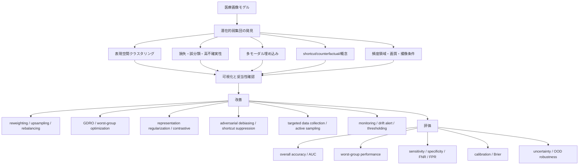

# 医療画像に関する深層学習での公平性研究における潜在的弱者集団の発見と改善

## Executive Summary

本サーベイの結論を先に述べると、**医療画像AIの公平性研究は、固定的な属性サブグループ監査から、表現空間・特徴空間・誤差空間に潜む「見えていない弱い集団」を発見し、そこを重点的に改善する方向へと明確に拡張している**、というのが過去数年の大きな流れです。初期の医療画像研究は、性別・年齢・人種など既知属性での性能差の測定に主眼がありましたが、Oakden-Raynerらの hidden stratification 研究以降、**平均性能では見えない臨床的に重要な失敗群**が存在し、しかもそれらは人口統計属性よりも、微妙な病変形態、撮像条件、治療デバイス、ラベル品質、施設差、頻度領域の違いなどにより形成されることが示されてきました（Oakden-Rayner et al., 2019/2020; Seyyed-Kalantari et al., 2021; Brown et al., 2023）。 citeturn25view0turn25view3turn8view4turn37search0

方法論的には、潮流は大きく五つに分かれます。第一に、**hidden stratification を監査する発見系研究**で、スキーマ補完・誤り監査・クラスタリングにより、「どこで壊れるか」を測ります。第二に、**表現クラスタリング型**で、GEORGE、Domino、近年の医療画像 slice discovery 研究のように、埋め込み空間でクラスタを作り worst-group を近似します。第三に、**損失・不確実性に基づく弱集団推定**で、JTT や Data-IQ、医療画像での epistemic uncertainty 監査のように、誤分類や不確実性そのものをサブグループ発見の信号として使います。第四に、**shortcut/testing/counterfactual 系**で、モデルが属性やアーティファクトに依存していないかを能動的に診断します。第五に、**発見した潜在集団上で fairness 最適化をかける統合型**で、2026年の LHCF はその代表例です。 citeturn18view2turn19view0turn17view0turn40view0turn12view0turn37search1turn15view1turn15view3

医療画像に特有なのは、**潜在弱集団が必ずしも人口統計属性と整列しない**ことです。MICCAI 2025 の Bissoto らは、胸部X線と皮膚病変で、発見されたサブグループが従来の demographic metadata よりも大きな性能差を露呈することを示し、CheXpertPlus では大多数が約90%精度の一方で 60%未満の精度しか出ない潜在集団、皮膚病変では 5% accuracy の極端な失敗群まで発見しました。さらに Olesen らは、胸部ドレーンや ECG ケーブルといった**非人口統計的 shortcut feature の性差分布**が、性別性能格差の原因になりうることを示しました。これは「公平性＝属性だけを見ること」では不十分で、**公平性監査は shortcut 監査・OOD監査・キャリブレーション監査と統合されるべき**ことを意味します。 citeturn16view2turn16view4turn36view1turn36view3

改善効果については、一般画像由来の latent subgroup robustification が今も重要な基盤です。GEORGE は proxy group を使った GDRO により worst-case subclass accuracy を最大 14ポイント改善し、平均 worst-case subclass error を 23%以上削減しました。JTT は group 情報なしでも worst-group accuracy gap の 85% を埋めました。一方で、医療画像では属性ベース fairness mitigation の限界も明確で、MEDFAIR は多くの既存 debiasing 手法が ERM を一貫して上回らないことを示し、Yang らの Nature Medicine 論文は、訓練分布内で「公平」に見えるモデルが外部分布では公平でないこと、むしろ demographic encoding の弱いモデルの方が OOD 下で“globally optimal”になりやすいことを示しました。 citeturn18view1turn18view4turn19view0turn11view1turn26view0

現時点で最も有望なのは、**潜在集団発見と改善を一体化し、かつ外部施設・多モダリティ・密な予測タスクまで拡張する研究**です。2026年の LHCF は、人口統計ラベルを使わず appearance-based hidden cohorts をクラスタリングし、その上で fairness loss を最適化することで、HAM10000・Fitzpatrick17K・CMMD で overall AUC、worst-case AUC、AUC gap、PSD を同時改善しました。だが、再現性・クラスタ安定性・臨床意味付け・密予測での評価体系・継続監視はまだ未成熟です。今後の優先課題は、**発見された潜在集団の安定性保証、臨床的意味づけ、OOD/uncertainty/calibration を統合した評価、そして発見後の targeted remediation を end-to-end に回す枠組み**です。 citeturn15view1turn15view3turn38search0turn8view2

## 調査範囲と全体像

本レポートは、過去10年を中心に、胸部X線、CT、MRI、病理画像、眼底・OCT、皮膚病変画像などを含む**医療画像における深層学習の fairness 研究**を対象とし、とくに「固定の属性サブグループではなく、**特徴空間上・モデル表現上で潜在的に性能が弱い集団・クラスターを発見し改善する**」研究を中心に整理しました。分類・検出・セグメンテーションに加え、representation learning、clustering、subgroup discovery、robustness、OOD、uncertainty-aware、shortcut/counterfactual、foundation model fairness まで含めています。既存レビューでも、医療画像 fairness 研究は評価と mitigation に大別される一方、近年は visual pattern や latent factor を掘りに行く研究が増えていると整理されています（Xu et al., 2024; Queiroz Neto et al., 2026）。 citeturn39view1turn39view2

背景として、医療画像 fairness の第一次波は、CheXclusion や underdiagnosis bias 研究のような**既知属性ベース監査**でした。これらは胸部X線で性別・年齢・人種・保険種別などに真陽性率・偽陰性率・偽陽性率の差があることを示し、multi-source 学習がギャップを減らしうる一方、交差属性ではさらに深刻な underdiagnosis が起こることを明らかにしました。だが、その後の hidden stratification 研究は、**属性ラベルだけでは本当の failure mode を捉えきれない**ことを示しました。 citeturn11view4turn8view4turn25view3

この流れは、一般画像分野の worst-group robustness 研究とも接続しています。GEORGE は「latent subclass を埋め込み空間から推定して GDRO する」枠組みを提示し、Domino は cross-modal embedding から coherent な underperforming slice を見つける定量枠組みを作り、JTT は高損失サンプルを proxy minority として再学習するシンプルな戦略を示しました。医療画像研究はこれらを取り込みつつ、**ラベルノイズ、施設差、臨床 shortcut、規模の小さい intersectional group、密予測の評価困難性**といった独自課題に向き合っています。 citeturn18view2turn18view4turn17view0turn19view0turn39view1

以下の模式図は、この研究領域の方法論的な流れをまとめたものです。



図の要点は、**「発見」と「改善」と「評価」を別々に扱う研究から、三者を一体化する研究へ移りつつある**ことです。特に最新の医療画像研究では、発見された潜在集団が demographic group と弱くしか整列しない一方、臨床リスクや visual structure とは整列する、という結果が繰り返し報告されています。 citeturn16view2turn16view4turn15view3

### 特徴空間クラスタリングの概念図

以下は、representation-based subgroup discovery の典型的な考え方を示す模式図です。これは GEORGE、Domino、Bissoto ら、Olesen ら、LHCF などに共通する「まず埋め込みに落とし、そこで cohesive かつ performance-gap の大きい cluster を探す」という発想を表したものです。 citeturn18view2turn17view0turn16view2turn36view3turn15view1

```text
                 特徴空間 z
        ↑
        |
   良好群  ○ ○ ○ ○ ○ ○
        |
        |                 潜在的弱群
        |              ● ● ● ● ●
        |            ● ● ● ● ● ●
        |
        |     ○ ○ ○ ○ ○
        |
        +--------------------------------→

凡例:
○ = 多数派/平均性能で隠れる群
● = 可視属性とは一致しないが一貫して性能が低い群

典型的パイプライン:
画像 → エンコーダ → 埋め込み z → 次元削減/クラスタリング
→ 各クラスタの性能・校正・不確実性を測定
→ 弱群に対して reweight / robust optimization / targeted data collection
```

## 主要先行研究の一覧

以下の表では、医療画像を中心に、一般画像の基盤研究も含めて、**潜在集団の発見と改善**に関係する主要研究を整理します。医療画像に直接適用されたもの、あるいは医療画像 fairness 研究の設計原理として強い影響を持つものを選びました。

| 論文 | 著者 | 年 | 会議/誌 | 問題設定 | 手法の要旨 | 潜在集団の発見方法 | 改善手法 | 評価指標 | データセット | 主要結果・効果量 | 出典 |
|---|---|---:|---|---|---|---|---|---|---|---|---|
| Hidden Stratification Causes Clinically Meaningful Failures in Machine Learning for Medical Imaging | Oakden-Rayner et al. | 2019 | ML4H at NeurIPS | 医療画像 | hidden stratification の測定枠組みを導入 | schema completion、error auditing、単純な教師なしクラスタリング | 直接の mitigation ではなく監査・測定 | 感度、ROC AUC、subset gap | 骨盤X線、MURA、ChestX-ray14 | clinically important subset で最大 20% の性能差。骨折X線で subtle fracture sensitivity 0.900、cervical fracture 0.911、overall 0.981。MURA degenerative disease AUC 0.76、overall 0.91 | citeturn25view0turn25view3 |
| Distributionally Robust Neural Networks for Group Shifts | Sagawa et al. | 2020 | ICLR | 一般画像/NLP | 既知 group 上で worst-group loss を最適化 | 既知 group 前提 | group DRO + 強い正則化/early stopping | worst-group accuracy、average accuracy | Waterbirds, CelebA, MultiNLI | regularization 付き group DRO により worst-group accuracy が 10–40pt 改善 | citeturn20search0turn20search1 |
| GEORGE: A Framework for Alleviating Hidden Stratification | Sohoni et al. | 2020 | NeurIPS | 一般画像 | latent subclass を proxy cluster として推定し GDRO | penultimate feature を次元削減・クラスタリング | proxy-group GDRO | worst-case subclass accuracy/error | 複数画像分類ベンチマーク | worst-case subclass accuracy を最大 14pt 改善。平均 worst-case subclass error を 23%以上削減。oracle GDRO は 50%削減 | citeturn18view1turn18view2turn18view4 |
| Underdiagnosis Bias of AI Algorithms Applied to Chest Radiographs in Under-served Populations | Seyyed-Kalantari et al. | 2021 | Nature Medicine | 医療画像 | 交差属性を含む underdiagnosis 監査 | 固定属性・交差属性監査 | 直接 mitigation なし | FPR/FNR、underdiagnosis rate | MIMIC-CXR, CheXpert, ChestX-ray14, multi-source | Black、保険種別、性別、年齢、交差属性で underdiagnosis disparity を系統的に確認 | citeturn8view4 |
| Evaluating Subgroup Disparity Using Epistemic Uncertainty in Mammography | Lu et al. | 2021 | ICML 2021 workshop | 医療画像 | uncertainty を subgroup auditing の補助情報として使用 | race/scanner subgroup に対する epistemic uncertainty 分析 | 改善よりも disparity 検出 | subgroup-level uncertainty、Kappa disparity | 108,190 mammograms, 33 sites | aggregate が近くても uncertainty 指標により subgroup disparity が顕在化 | citeturn12view0turn12view1 |
| Just Train Twice | Liu et al. | 2021 | ICML | 一般画像/NLP | 初回 ERM の高損失例を minority proxy とみなして再学習 | 高訓練損失例の選別 | upsampling / reweighting | worst-group accuracy | 画像分類ベンチマーク等 | group 情報の大半なしで worst-group accuracy gap の 85% を埋める | citeturn19view0turn19view1 |
| Domino: Discovering Systematic Errors with Cross-Modal Embeddings | Eyuboglu et al. | 2022 | ICLR | 一般画像・医療画像含む | error-aware mixture model で coherent error slice を発見し記述 | cross-modal embedding + mixture model | 主として discovery / debugging | slice identification accuracy、coherence、language description | 1,235 slice settings across natural/medical/time-series | 1,235設定で 36% の slice を同定、従来比 +12pt。35% で exact natural-language description | citeturn17view0turn17view2 |
| Improving the Fairness of Chest X-ray Classifiers | Zhang et al. | 2022 | CHIL | 医療画像 | chest X-ray で multiple fairness methods を比較 | 固定属性group | data balancing, DRO系比較 | worst-group, group fairness metrics | CXR datasets | 既存 worst-group 改善法は simple data balancing を上回らないと報告 | citeturn11view0 |
| Detecting Shortcut Learning for Fair Medical AI using Shortcut Testing | Brown et al. | 2023 | Nature Communications | 医療画像 | multitask 学習と gradient reversal 強度を変え、shortcut が fairness gap の原因かを直接検査 | shortcut testing、attribute encoding の介入 | gradient reversal による shortcut 抑制ファミリ | fairness gap、shortcut dependence | radiology, dermatology tasks | demographic encoding の有無だけでは shortcut 利用度は分からず、shortcut が原因でない unfairness も存在 | citeturn37search0turn37search1 |
| How Fair are Medical Imaging Foundation Models? | Khan et al. | 2023 | ML4H / PMLR 225 | 医療画像 | foundation model の pretraining と fairness の関係を解析 | subgroup fairness を sex/race で解析、representation bias を検討 | balanced fine-tuning、pretraining volume/epoch 増加 | AUC、fairness gap | ChestXray14, CheXpert など | pretraining data を増やすと AUC 79.97→80.98→81.38、sex gap 1.58→1.49→1.29、race gap 3.09→2.85→2.82。medical pretraining は overall は良いが fairness は悪化しうる | citeturn27view0turn27view1turn27view3turn27view4 |
| MEDFAIR: Benchmarking Fairness for Medical Imaging | Zong et al. | 2023 | ICLR | 医療画像 | 10前後の医療画像 dataset と 11 法を統一ベンチマーク | 主に属性group | 既存 debiasing 手法の系統比較 | ID/OOD fairness、selection criterion | 10 datasets, multiple modalities | selection criterion が fairness に大きく影響。多くの SOTA debiasing は ERM を一貫して上回らない | citeturn11view1 |
| Improving Fairness of Automated Chest Radiograph Diagnosis by Contrastive Learning | Lin et al. | 2024 | Radiology: AI | 医療画像 | fair embedding を supervised contrastive learning で学習 | 明示的 latent cluster 発見ではないが表現を subgroup-invariant 化 | supervised contrastive representation learning | ΔmAUC | MIDRC, NIH ChestX-ray14 | ΔmAUC が sex 0.01、race 0.21、age 0.10（MIDRC）、sex 0.01・age 0.05（NIH-CXR）まで低下し、baseline より bias 減少 | citeturn34view0 |
| The Limits of Fair Medical Imaging AI in Real-world Generalization | Yang et al. | 2024 | Nature Medicine | 医療画像 | demographic shortcut と OOD fairness の相互作用を解析 | embedding に埋め込まれた demographic encoding と OOD fairness の比較 | shortcut correction、model selection | FPR/FNR gap, OOD fairness | 6 CXR datasets + ISIC + ODIR | training分布内で“公平”でも OOD では維持されない。demographic encoding が弱いモデルの方が OOD で globally optimal。ODIR では age FNR gap 43% | citeturn26view0 |
| Slicing Through Bias | Olesen et al. | 2024 | arXiv preprint | 医療画像 | SDM で underperforming slice を発見し原因仮説を立てる | image representation → 次元削減 → clustering → cluster selection | targeted mitigation を提案、直接実装は限定的 | AUROC、Brier score、slice disparity | NIH-CXR14, CheXpert | 胸部ドレーンと ECG wires が sex performance gap の原因候補。ECG cables は worst slice で 50%、best slice で 99% | citeturn8view1turn36view0turn36view1turn36view3 |
| Subgroup Performance Analysis in Hidden Stratifications | Bissoto et al. | 2025 | MICCAI | 医療画像 | subgroup discovery を performance monitoring に接続 | simplified subgroup discovery、CLIP/BiomedCLIP 埋め込み、purity評価 | 監視・ reporting。training-time mitigation ではない | accuracy、performance gap、purity | CheXpertPlus, SLICE-3D | CheXpertPlus で <60% accuracy の underperforming subgroup、他方多くは約90%。SLICE-3D で 5% accuracy subgroup。demographic metadata より大きな gap を露出 | citeturn16view1turn16view2turn16view4 |
| Mutual Information Regularization for Fairness-aware Deep Imaging Representations | Sadri et al. | 2025 | MICCAI | 医療画像 | sensitive attribute と表現の MI を抑えて fair representation を学習 | latent cluster 発見ではないが representation-based fairness | MI regularization | fairness metrics、accuracy | 3D OCT, rectal MRI | 約3,500例、DenseNet/ViT で fairness-aware representations を報告 | citeturn33search1turn33search4 |
| Revealing Hidden Failure Modes in Chest X-ray Classification via Spectral Domain Analysis | Halimi et al. | 2026 | MIDL | 医療画像 | 画像周波数スペクトルから blind spot を発見 | frequency-domain profile + unsupervised clustering | reliability prediction / auditing | cluster-concentrated failure, reliability | chest X-ray anomaly detection | error は特定 spectral cluster に集中し、semantic metadata に見えない blind spot を抽出 | citeturn8view0turn35view2turn35view4 |
| SEG4SEG: Identifying Systematic Failure Modes in Segmentation by Subgroup Discovery Methods | Weng et al. | 2026 | MIDL | 医療画像セグメンテーション | segmentation に SDM を適応 | subgroup discovery adapted for dense prediction | 失敗監査・failure analysis | systematic error identification | controlled + real-world medical segmentation | 四つの制御失敗タイプと二つの実データ失敗例で、SDM が segmentation systematic error を同定可能と報告 | citeturn38search0 |
| A Multimodal Slice Discovery Framework for Systematic Failure Detection and Explanation in Medical Image Classification | Liu et al. | 2026 | arXiv preprint | 医療画像 | 画像・報告書・metadata を統合して black-box classifier の failure slice を抽出 | multimodal representation clustering | 説明と監査、deployment monitoring | systematic failure detection, explanation | multimodal medical classification | multimodal representation により slice discovery と explanation の信頼性向上を主張 | citeturn8view2 |
| Fairness Beyond Demographics: Optimizing Performance Across Appearance-Based Hidden Cohorts in Medical Imaging | Masroor et al. | 2026 | arXiv preprint | 医療画像 | hidden cohort fairness を demographic-label-free で最適化 | appearance-based clustering、BIC-selected cohorts | hidden-cohort fairness optimization; SWAD/FIS/FEBS/FairCLIP/FaMI/FairDi と組合せ | Overall AUC, Min AUC, ES-AUC, AUC Gap, PSD, Brier | HAM10000, Fitzpatrick17K, CMMD | FairDi では Overall AUC 0.9014→0.9050、Min AUC 0.8511→0.8686、Gap AUC 0.0824→0.0666、Mean PSD 0.0354→0.0312。demographic labels 不要 | citeturn15view0turn15view1turn15view3 |

### 表から読み取れること

この一覧からまず明確なのは、**「発見だけ」をやる研究が長く先行し、「発見した潜在集団を訓練目標に組み込んで改善」する研究はまだ少数**だという点です。医療画像で discovery と mitigation を明確に統合した代表例は、現状では LHCF が最も直接的です。一方、GEORGE や JTT は一般画像由来ですが、latent subgroup robustification の設計原理として依然きわめて重要です。 citeturn18view2turn19view0turn15view1

次に、医療画像では**潜在集団の意味内容が多層的**です。Bissoto らや Olesen らは visual feature・artifact・撮像条件に近い slice を拾い、Halimi らは周波数領域の差から blind spot を拾い、Liu らは report と metadata を含めた multimodal representation でfailure slice を拾おうとしています。これは、「潜在集団」は一種類のものではなく、**形態学的群、撮像群、画質群、shortcut 群、業務フロー群**が混在しうることを示します。 citeturn16view2turn36view3turn35view2turn8view2

最後に、医療画像分野では dense prediction への拡張がまだ新しいものの、2026年の SEG4SEG がその端緒を与えました。これにより、latent subgroup fairness を分類だけでなく、**セグメンテーションの局所失敗モード**まで広げる道筋が見えてきています。 citeturn38search0

## 手法分類と比較

### 手法の分類マトリクス

以下では、**発見手法 × 改善手法 × 評価軸**で研究群をマトリクス化します。完全に単一カテゴリに収まらない論文もあるため、代表的な主成分で分類しています。

| 発見手法 | 代表研究 | 改善手法 | Accuracy/AUC | Sensitivity/Specificity/FNR/FPR | Worst-group / Min AUC | Calibration / Brier | Uncertainty / OOD |
|---|---|---|---|---|---|---|---|
| スキーマ補完・誤り監査 | Oakden-Rayner et al.; Seyyed-Kalantari et al. | 監査中心、設計改善の示唆 | ◎ | ◎ | ○ | △ | △ |
| 表現空間クラスタリング | GEORGE; Bissoto et al.; Olesen et al. | GDRO、targeted mitigation、monitoring | ◎ | ○ | ◎ | ○ | ○ |
| cross-modal / multimodal slice discovery | Domino; Liu et al. | 主に監査・説明、将来的には targeted retraining | ○ | △ | ◎ | △ | ○ |
| 高損失・誤分類ベース proxy group | JTT | upsampling / reweighting | ◎ | △ | ◎ | △ | △ |
| 不確実性ベース stratification | Lu et al.; Data-IQ | thresholding、feature acquisition、monitoring | ○ | ○ | ○ | ○ | ◎ |
| shortcut testing / counterfactual | Brown et al.; Olesen et al. | adversarial suppression、shortcut removal、targeted relabel | ○ | ◎ | ○ | △ | ◎ |
| 表現正則化・contrastive fairness | Lin et al.; FaMI; FairREAD | representation regularization、adversarial disentanglement、threshold tuning | ◎ | ○ | ○ | △ | ○ |
| appearance-based hidden cohort optimization | LHCF | hidden cohort fairness optimization | ◎ | ○ | ◎ | ○ | ○ |
| 周波数領域クラスタリング | Halimi et al. | reliability prediction、slice-aware triage | ○ | △ | ○ | △ | ◎ |
| segmentation-specific subgroup discovery | SEG4SEG | 失敗監査、将来の targeted correction へ接続 | ○ | ○ | ◎ | ○ | ○ |

このマトリクスから分かるのは、**発見手法と改善手法の組み合わせはまだ疎である**ということです。たとえば、multimodal slice discovery は説明力が高い一方、そこからどう再学習へ接続するかは未成熟です。また uncertainty 系は deployment monitoring に向く一方、worst-group fairness の改善へ直結した研究はまだ少ないです。逆に、JTT や GEORGE のような改善寄り手法は強いものの、臨床的意味づけや説明可能性は相対的に弱い傾向があります。 citeturn17view0turn18view2turn19view0turn12view0turn8view2turn15view1turn38search0

### 評価軸ごとの含意

accuracy/AUC が改善しても公平になるとは限らない、という点は医療画像では特に強く示されています。MEDFAIR は model selection criterion が fairness outcome を大きく左右し、SOTA mitigation が ERM を安定して上回らないと報告しました。Khan らも foundation model で overall accuracy と subgroup fairness の trade-off を確認しました。つまり、**平均性能だけを最適化する訓練とモデル選択は latent weak groups を悪化させうる**ということです。 citeturn11view1turn27view4

また、医療画像で公平性を論じるとき、sensitivity / specificity よりも**どの誤りが患者 harm に結びつくか**が重要です。Yang らは screening 文脈で “No Finding” には FPR、それ以外には FNR を重視し、Seyyed-Kalantari らは underdiagnosis を false positive of “No Finding” として定義しました。隠れた弱集団発見でも、最終的には**臨床的に重要な error type に整列した評価軸**を選ばなければなりません。 citeturn26view0turn8view4

さらに、Bissoto らや LHCF が示すように、calibration / Brier と fairness を一緒に見ることが重要です。なぜなら latent cohort はしばしば「正答率が低い群」であると同時に「確信の置き方が悪い群」でもあるからです。とくに hidden cohort を clinical risk stratification に結びつけるには、**accuracy gap より calibration gap の方が臨床的に有意味**な場合があります。 citeturn15view2turn15view3turn16view2

## 医療画像特有の課題と評価上の注意点

医療画像で latent subgroup fairness を扱う難しさは、単に「クラスタリングが難しい」ことではありません。より本質的には、**何を subgroup と呼ぶべきかが臨床・撮像・データ収集過程・ラベル生成過程にまたがっている**点にあります。一般画像と異なり、画像の見た目だけでなく、撮像プロトコル、施設、デバイス、治療後デバイス、病期、患者背景、読影慣習が相互作用し、それらが latent cluster に混ざります。そのため、発見されたクラスタが「臨床的意味を持つ脆弱群」なのか、「単なる nuisance cluster」なのかを区別しなければなりません。Oakden-Rayner らは low prevalence、poor label quality、subtle discriminative feature、spurious correlate が hidden stratification の主要因だと整理し、Olesen らは chest drain や ECG wire が性差に見える gap の実体であることを示しました。 citeturn25view2turn25view3turn36view1turn36view3

この点から、医療画像特有の注意点は次のように整理できます。

- **人口統計属性と潜在群は一致しない**。Bissoto らと LHCF は、発見された hidden groups が demographics とは弱くしか整列しない一方、performance gap や clinical risk とは強く結びつくことを示しました。したがって demographic parity のみを監査しても、本質的 failure mode を見逃しえます。 citeturn16view4turn15view3
- **shortcut と公平性は直交しない**。shortcut は sensitive attribute そのものではなくても、その prevalence difference を通じて属性 gap を生みます。胸部ドレーン・ECG cables の例はその典型です。 citeturn36view1turn36view3
- **OOD と fairness は同時に扱うべき**。ID で公平に見えるモデルが OOD で崩れることは、Nature Medicine 2024 が明確に示しました。外部施設・国際データ・時系列 drift を含む評価が必要です。 citeturn26view0
- **分類とセグメンテーションで subgroup の定義が違う**。分類では case-level slice が自然ですが、セグメンテーションでは lesion size、境界曖昧性、器官位置、撮像位相などが pixel/region-level で作用します。SEG4SEG はこの差を埋める最初期の研究です。 citeturn38search0
- **クラスタ数とクラスタ安定性が結果を左右する**。LHCF でも moderate number of cohorts が良い trade-off を示すとされ、Bissoto らも hyperparameter と purity/gap の安定性を評価しています。単一 seed の k-means 結果を fairness の根拠にしてはいけません。 citeturn15view1turn15view3turn16view2
- **医療 harm に対応したメトリクス設計が欠かせない**。No Finding の FPR と疾患分類の FNR は意味が違います。sensitivity, specificity, PPV, NPV, calibration, coverage を clinical workflow に沿って選び分ける必要があります。 citeturn8view4turn26view0
- **subgroup discovery の妥当性確認には human-in-the-loop が必要**。Domino、Bissoto、Olesen、Liu らの系譜はいずれも「自動発見した slice を臨床的に説明・監査可能であること」が価値の中心です。純粋な clustering 指標だけでは不十分です。 citeturn17view0turn16view2turn8view2

### 実験設定の再現性に関する比較

| 手法ファミリ | 代表研究 | 必要なデータ量 | ラベル要件 | 計算コスト | 実装難易度 | 再現性上の注意 |
|---|---|---|---|---|---|---|
| hidden stratification 監査 | Oakden-Rayner et al. | 中 | task label 必須、subclass label は test 側で一部あると望ましい | 低〜中 | 中 | clinician audit の質に依存。subclass schema が研究者依存になりやすい |
| group DRO 既知群 | Sagawa et al. | 中 | group label 必須 | 中 | 中 | regularization と early stopping が強く効く。group 定義で結果が変わる |
| proxy-group clustering + GDRO | GEORGE | 中〜大 | task label 必須、attribute label 不要 | 中〜高 | 高 | 埋め込み品質、次元削減、k推定、cluster stability が結果に強く影響 |
| high-loss proxy mining | JTT | 中 | task label 必須、全 train で group label 不要 | 中 | 低〜中 | 初期 ERM の学習段階に敏感。hard-but-noisy 例を minority proxy と誤認しうる |
| cross-modal slice discovery | Domino | 中〜大 | task label と説明テキストがあると強い | 高 | 高 | 医療では report quality と image-text alignment が性能と説明性を左右 |
| uncertainty-based stratification | Lu et al.; Data-IQ | 中〜大 | task label 必須、属性ラベルは評価時のみ | 中〜高 | 中 | ensemble/dropout の実装差、uncertainty decomposition の定義差が大きい |
| shortcut testing / counterfactual | Brown et al. | 中 | sensitive attribute label が必要なことが多い | 中〜高 | 高 | shortcut の causal relevance を誤ると“正当な”臨床情報まで消しうる |
| representation debiasing / contrastive | Lin et al.; FaMI; FairREAD | 中〜大 | task label 必須、属性ラベルは多くの場合必要 | 中〜高 | 中〜高 | fairness metric に合わせた sampling/penalty 設計が必要 |
| monitoring-oriented subgroup discovery | Bissoto et al.; Halimi et al. | 中 | task label 必須、属性ラベル不要でも可 | 低〜中 | 中 | 実装は比較的容易だが、得られた subgroup の臨床意味づけが必須 |
| hidden cohort fairness optimization | LHCF | 中〜大 | task label 必須、demographic label 不要 | 高 | 高 | clustering stage の安定性、cohort number、backbone の選択に敏感 |
| segmentation slice discovery | SEG4SEG | 中〜大 | dense label 必須、属性ラベル不要 | 高 | 高 | dense task 特有の metric choice と slice 定義が未標準化 |

表から分かるように、**属性ラベル不要**という意味で実運用に乗せやすいのは monitoring-oriented discovery、GEORGE 型、JTT 型、LHCF 型ですが、その代わり**臨床的説明可能性とクラスタ安定性の検証負荷**が増えます。逆に、属性ラベルを使う adversarial/debiasing や representation disentanglement は設計しやすいものの、現場で必要な sensitive attributes を揃えられないことが少なくありません。医療画像ではこのトレードオフが特に強く、**「ラベル不要な discovery」→「最小限の追加監査」→「targeted remediation」**という三段階設計が現実的です。 citeturn18view2turn19view0turn16view1turn15view1turn38search0

## 研究ギャップと今後の研究提案

### 優先度の高い研究ギャップ

**最優先のギャップは、発見された潜在集団の妥当性と安定性をどう保証するか**です。現状、多くの研究は良い cluster を見つけたことを case study 的に示す一方、seed・backbone・dataset split・外部施設移行に対する subgroup stability を十分に測っていません。Bissoto らと LHCF は一歩進んでいますが、まだ標準化された stability benchmark はありません。潜在群が再現しないなら、その群の worst-group optimization は policy として危ういです。 citeturn16view2turn15view3

**次に重要なのは、classification 以外、とくに segmentation・detection・report generation への拡張**です。現状の latent subgroup fairness は分類中心で、SEG4SEG は先駆的ですが、dense prediction の估計軸、pixel-level calibration、lesion-size-conditioned failure、false negative hotspot の扱いはまだ未整備です。foundation model 時代には segmentation FM、VLM、multimodal FM が普及するため、この空白は大きいです。 citeturn38search0turn11view3turn39view2

**三つ目は、OOD・uncertainty・fairness の統合**です。Yang らが示したように、ID fairness を改善しても OOD で崩れるなら臨床上は不十分です。latent subgroup discovery を deployment monitoring に組み込み、cluster-level calibration drift や reliability decay を継続監視する仕組みが必要です。Halimi ら、Lu ら、Liu らの方向性はこの統合へ向いていますが、まだ audit 側が中心です。 citeturn26view0turn35view4turn12view0turn8view2

### 優先度付き研究提案

**高優先度提案**として、まず **安定な潜在群 discovery benchmark** を提案します。具体的には、複数施設・複数モダリティ・classification/segmentation を横断し、各手法について cluster stability、external transferability、clinical interpretability、worst-group utility を同時評価するベンチマークです。Bissoto らの purity/performance-gap 指標と LHCF の hidden-cohort quality 指標を統合し、subgroup discovery の「見つかった/見つからなかった」ではなく、**再学習後の便益まで含めた utility benchmark** にすべきです。 citeturn16view2turn15view2

**高優先度提案**の第二は、**discovery と mitigation の end-to-end 接続**です。現状は「クラスタ発見」と「その後の再学習」が分離されがちです。今後は、(i) 潜在群推定の安定化、(ii) proxy group に対する robust objective、(iii) cluster-level calibration constraint、(iv) OOD-aware validation を一つの学習ループにまとめるべきです。設計としては GEORGE の proxy-group DRO と LHCF の hidden cohort fairness をつなぐのが自然です。 citeturn18view2turn18view4turn15view1turn15view3

**高優先度提案**の第三は、**multimodal latent subgroup discovery** です。医療画像の失敗群は画像単体では見えない場合が多く、report・EHR・撮像メタデータを含めると初めて意味が分かることがあります。2026年の multimodal slice discovery はこの方向の最初の試みで、今後は公平性最適化まで組み込む必要があります。とくに radiology では report 中の uncertainty language、indication、portable vs PA/AP view、device mention が潜在群説明に効く可能性が高いです。 citeturn8view2turn34view0

**中優先度提案**としては、**counterfactual と concept bottleneck の導入**が有望です。発見された cluster をそのまま fairness unit にするだけでなく、「どの概念を変えればその cluster から脱しうるのか」を問う必要があります。shortcut counterfactual は non-sensitive shortcut の因果影響を測るのに向き、concept-based rule learning は latent cluster を clinician-readable rule に変換する基盤になります。医療画像では cluster のままでは監査責任を果たしにくいため、**cluster → concept → intervention** の橋渡しが重要です。 citeturn37academia10turn29search4turn29search6

**中優先度提案**として、**active sampling / targeted relabeling** も強く推奨されます。Oakden-Rayner の hidden stratification 研究が示した通り、低頻度・微妙な病変・低品質ラベルは潜在弱群の主要因です。したがって discovery 後には、単なる reweighting だけでなく、**その群への追加アノテーション、再撮像条件の収集、画質補正、label cleaning** を行うべきです。JTT や Data-IQ の知見は、どのサンプル・どの特徴が追加価値を持つかの選定に使えます。 citeturn25view2turn19view0turn40view0

### 総括的な見解

総じて、医療画像 fairness 研究の本当のボトルネックは、もはや「性別や年齢で性能を出し分けているか」だけではありません。むしろ、**モデルがどの潜在的 slice で体系的に失敗し、その失敗が患者 harm とどう結びつき、どの intervention がそこを最も効率よく改善するか**を定量化できていないことが核心です。今後の研究競争力は、単純な fairness metric の改善ではなく、**hidden subgroup discovery の信頼性、説明性、介入可能性、外部分布耐性**を同時に満たす設計にあると考えられます。 citeturn39view1turn26view0turn15view3turn38search0

## 主要参照

主要な原著・レビューは以下です。本文では各所で引用していますが、技術者・研究者向けの出発点として、とくに重要なものをまとめます。

- Oakden-Rayner et al., **Hidden Stratification Causes Clinically Meaningful Failures in Machine Learning for Medical Imaging**, ML4H at NeurIPS 2019. hidden stratification の問題設定を医療画像で明確化した起点。 citeturn25view0turn25view3
- Sohoni et al., **GEORGE: A Framework for Alleviating Hidden Stratification**, NeurIPS 2020. latent cluster discovery と GDRO をつなぐ代表的基盤研究。 citeturn18view1turn18view2turn18view4
- Seyyed-Kalantari et al., **Underdiagnosis Bias of AI Algorithms Applied to Chest Radiographs in Under-served Patient Populations**, Nature Medicine 2021. 属性ベース underdiagnosis 監査の代表。 citeturn8view4
- Liu et al., **Just Train Twice**, ICML 2021. 高損失例を proxy minority とみなす軽量 robustification。 citeturn19view0
- Eyuboglu et al., **Domino**, ICLR 2022. cross-modal embedding を用いた slice discovery。 citeturn17view0
- Brown et al., **Detecting Shortcut Learning for Fair Medical AI using Shortcut Testing**, Nature Communications 2023. shortcut と fairness gap の因果診断。 citeturn37search0turn37search1
- Zong et al., **MEDFAIR**, ICLR 2023. 医療画像 fairness benchmarking の基礎ベンチマーク。 citeturn11view1
- Khan et al., **How Fair are Medical Imaging Foundation Models?**, 2023. FM 時代の subgroup fairness 分析。 citeturn27view0turn27view3
- Lin et al., **Improving Fairness of Automated Chest Radiograph Diagnosis by Contrastive Learning**, Radiology: AI 2024. 表現学習ベースの fairness mitigation。 citeturn34view0
- Yang et al., **The Limits of Fair Medical Imaging AI in Real-world Generalization**, Nature Medicine 2024. OOD 公平性の限界と model selection の重要性。 citeturn26view0
- Xu et al., **Addressing Fairness Issues in Deep Learning-based Medical Image Analysis: A Systematic Review**, npj Digital Medicine 2024. 現状の包括レビュー。 citeturn39view1
- Olesen et al., **Slicing Through Bias**, 2024 preprint. chest drain/ECG wire のような shortcut 起因 gap を SDM で説明。 citeturn8view1turn36view3
- Bissoto et al., **Subgroup Performance Analysis in Hidden Stratifications**, MICCAI 2025. 医療画像で subgroup discovery を performance monitoring に接続した代表研究。 citeturn16view1turn16view4
- Weng et al., **SEG4SEG**, MIDL 2026. segmentation への subgroup discovery 拡張。 citeturn38search0
- Halimi et al., **Revealing Hidden Failure Modes in Chest X-ray Classification via Spectral Domain Analysis**, MIDL 2026. frequency-domain failure slices の発見。 citeturn8view0turn35view2
- Masroor et al., **Fairness Beyond Demographics**, 2026 preprint. appearance-based hidden cohort 上の fairness optimization を医療画像で実証。 citeturn15view1turn15view3

## Open questions と限界

本サーベイでは最新研究まで追いましたが、**2025–2026 の一部研究は preprint または会議録公開直後であり、査読成熟度が揃っていません**。とくに LHCF、multimodal slice discovery、spectral failure discovery、SEG4SEG は方向性として重要ですが、長期追試はまだ限定的です。 citeturn15view1turn8view2turn8view0turn38search0

また、いくつかの研究は出力可能な公開要約・本文断片から主要結果を参照しており、**全表について完全な実験条件の細部を同じ解像度で比較できているわけではありません**。特に一部の uncertainty 研究や concept-based 研究は、潜在弱集団の「発見」と「改善」の両方を揃えていないため、本レポートでは discovery-oriented 研究として位置付けました。この点は、今後より統一的な benchmark が整備されることで改善されるはずです。 citeturn12view0turn39view1